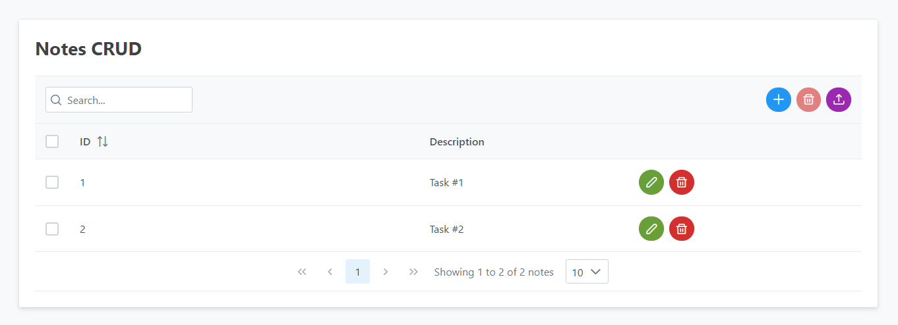
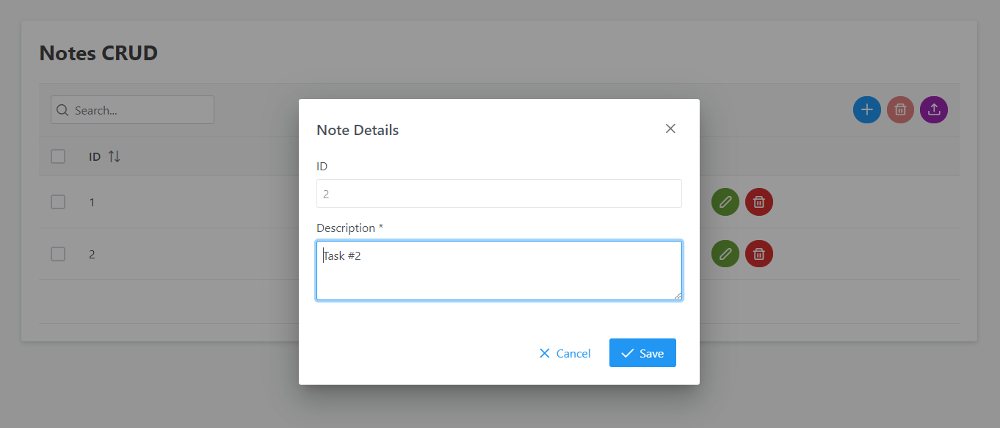

# SRF CRUD Sample

This is a Spring-Boot, React and Flutter application with the basics of CRUD.

Inside each folder has a README.md file showing how to execute then.

## Screnshots (React)

Dashboard

Form

> I hope this app help you in some way!
